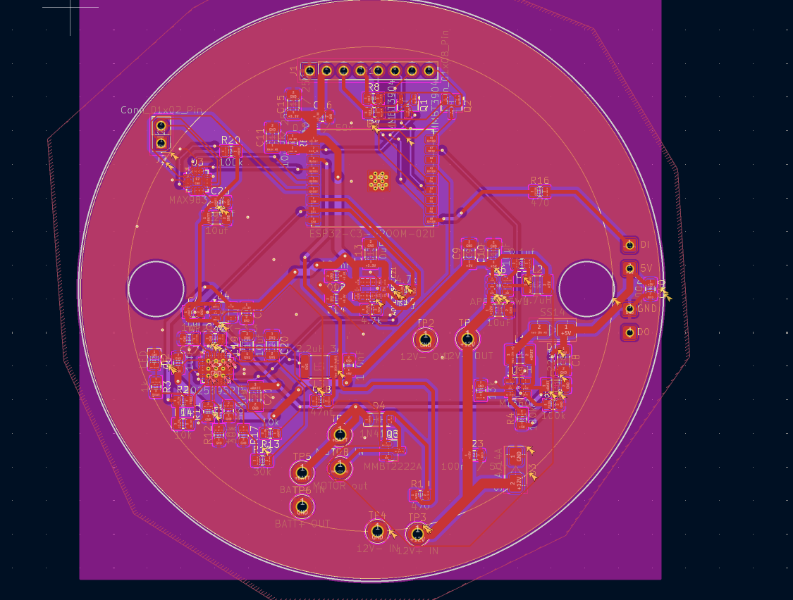
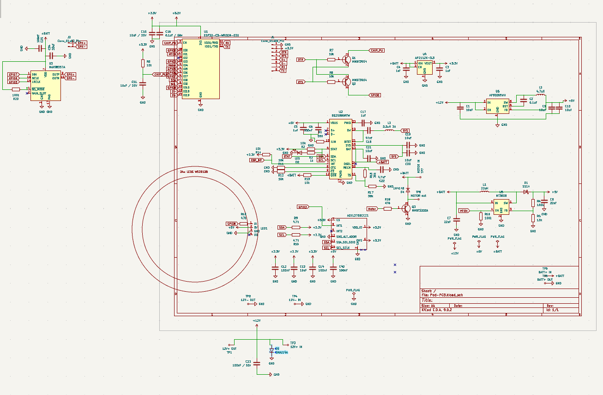
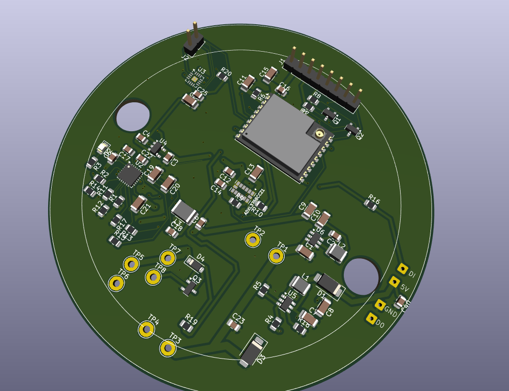

# NeoXalle-PCB-Slave

A full PCB work for a sport sensorial reaction device called NeoXalle.

**Overview**

This repository contains the design files and the images of each part.

### [Watch this video on YouTube](https://youtu.be/leAVq9ZJ1fE)
**Screenshots**

**Repository layout**

- `pcb/` — KiCad schematic and PCB files-
- `images/` — project screenshots used by this README

